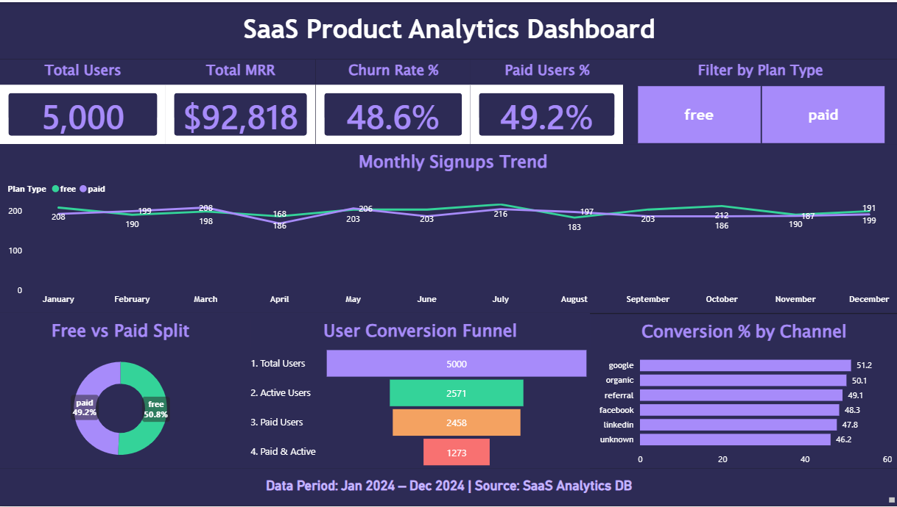
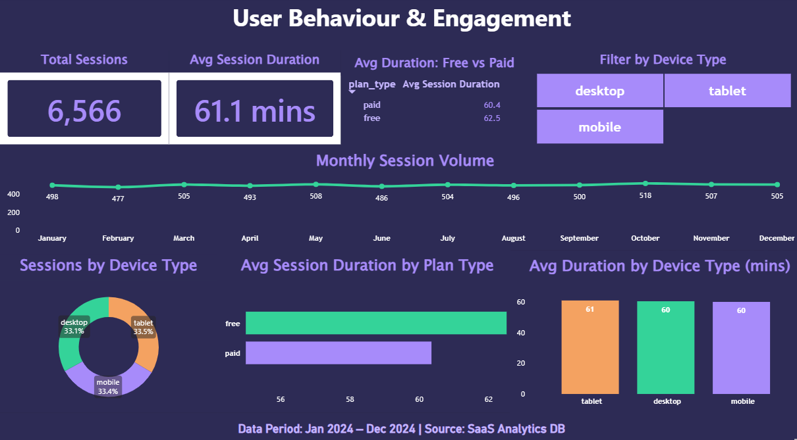
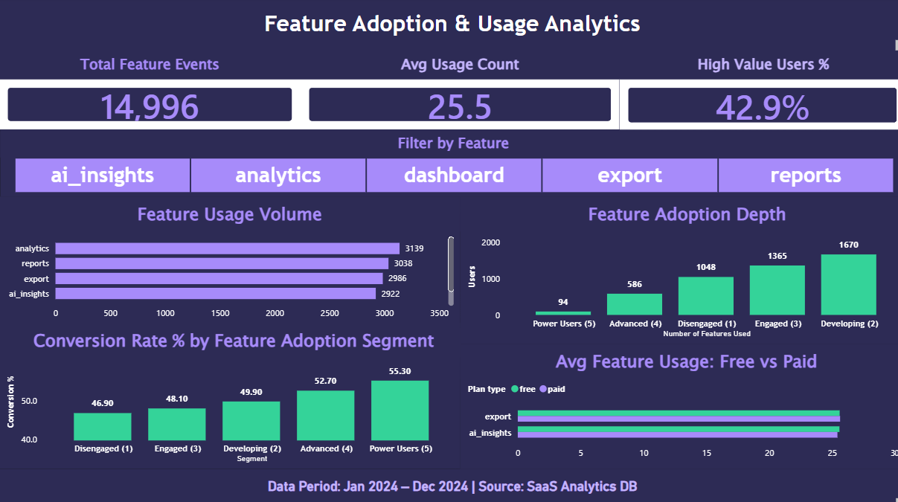
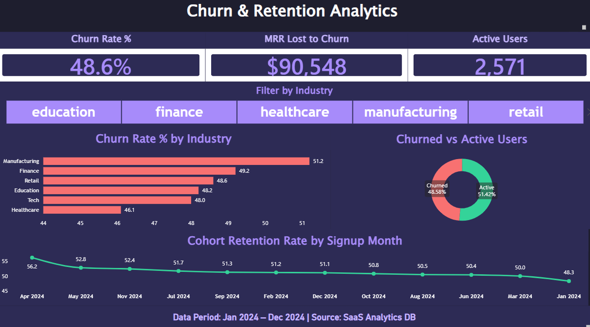

# SaaS Product Analytics Dashboard

**End-to-end product analytics solution built with SQL Server, Power BI, and Python**
## 🔗 Live Dashboard

**[View Interactive Dashboard →](https://app.powerbi.com/view?r=eyJrIjoiZDI3NDdkYmEtYzVlMi00OWY3LWE4OGItZDc2MTdiYzM0ZTg4IiwidCI6IjgxNzlhMDY3LTM5NGYtNDI2ZS05M2RhLTMzZmM4MjJmYTgxNSJ9&pageName=8486aca82e4a8c85e571)**

*Published via Power BI Service — no login required, fully interactive*



---

## Business Problem

B2B SaaS companies live and die by two numbers — Monthly Recurring Revenue and churn rate. Without structured analytics, product and growth teams have no visibility into:

- Why free users aren't converting to paid plans
- Whether paid users are actually getting more value than free users
- Which features drive conversion and which are being ignored
- Which user cohorts retain best and which churn fastest
- What the true revenue impact of churn is every month

The result is a product team making decisions based on intuition rather than data — spending acquisition budget on channels that churn, building features nobody uses, and watching MRR flatline while churn silently offsets every new signup.

---

## Solution

An end-to-end analytics dashboard that gives product managers, customer success teams, and leadership a single view of product health — tracking user behaviour, feature adoption, churn patterns, and revenue metrics across 12 months of data (January 2024 – December 2024).

**Key insights the dashboard surfaces:**
- Free-to-paid conversion rate at every funnel stage
- Feature adoption depth and its direct relationship to conversion
- Session engagement split by plan type and device
- Churn rate by industry, acquisition channel, and signup cohort
- MRR retained vs MRR lost to churn every month
- Which acquisition channels bring the highest lifetime value users

---

## Tech Stack

| Tool | Purpose |
|------|---------|
| Python (Pandas, NumPy, Matplotlib) | Exploratory Data Analysis |
| SQL Server | Data storage, cleaning, transformation, analytical queries |
| Power BI (DAX, Power Query) | Interactive 4-page dashboard |

---

## Dataset

Dataset built to mirror real B2B SaaS operations for a project management tool similar to Notion or Asana, with realistic data quality issues across all tables.

**4 tables — 45,000+ records:**

| Table | Rows | Description |
|-------|------|-------------|
| users | 5,000 | User demographics, plan type, acquisition channel, signup date |
| sessions | 6,566 | Session logs after deduplication (raw: 20,000) with device type and duration |
| feature_usage | 14,996 | Feature interaction logs per user across 5 features |
| subscriptions | 5,000 | Subscription status, MRR, churn flag, plan dates |

**Data quality issues present:**
- Mixed date formats (YYYY-MM-DD, MM/DD/YYYY, DD-MM-YYYY) across all date columns
- Inconsistent plan_type casing (free, Free, FREE, paid, Paid, PAID)
- NULL values in 5–8% of key columns across all tables
- 13,434 duplicate session records requiring deduplication
- Missing acquisition channel values (5% NULL)
- Inconsistent churned flag casing (y/Y/n/N)

---

## Project Structure

```
SaaS-Product-Analytics-Dashboard/
│
├── data/
│   ├── users.csv
│   ├── sessions.csv
│   ├── feature_usage.csv
│   └── subscriptions.csv
│
├── screenshots/
│   ├── page1_executive_overview.png
│   ├── page2_user_behaviour.png
│   ├── page3_feature_adoption.png
│   └── page4_churn_retention.png
│
├── saas_analytics_complete.sql
├── saas_analytics_eda.py
└── README.md
```

---

## SQL Scripts

The SQL script (`saas_analytics_complete.sql`) is structured in 3 sections.

**Section 01 — Data Cleaning**
- Standardised plan_type and churned casing using LOWER/UPPER + LTRIM/RTRIM
- Fixed mixed date formats using TRY_CONVERT with format codes 23 (ISO), 101 (US), 105 (European) applied sequentially — TRY_CONVERT returns NULL on failure rather than throwing an error, enabling safe cascading conversion
- NULL imputation: plan_type → 'free', acquisition_channel → 'unknown', duration_minutes → median 61, MRR → 0 for free / median 59 for paid, churned → 'N'
- Removed 13,434 duplicate session records keeping MIN(session_id) per user+date+device combination
- Left genuine NULLs (signup_date, plan_end_date for free users) intact — meaningful absence of data, not accidental

**Section 02 — Analytical Queries**
- Executive metrics: total users, MRR, churn rate, monthly signup trend by plan type
- User behaviour: avg session duration by plan type and device, monthly session volume
- Feature adoption: usage by feature, adoption depth per user, high-value user segmentation
- Churn analysis: churn by industry, channel, country, MRR lost to churn, cohort retention
- Conversion funnel: 5,000 → 2,571 active → 2,458 paid → 1,273 paid and active

**Section 03 — Star Schema Design**
```
users (1) ──── (1) subscriptions
users (1) ──── (*) sessions
users (1) ──── (*) feature_usage
```

---

## Dashboard — 4 Pages

### Page 1 — Executive Overview

High-level product health snapshot for CEO and VP of Product.


**KPI Cards:** Total Users · Total MRR · Churn Rate % · Paid Users %

**Visuals:**
- Monthly Signups Trend — dual-line chart showing free vs paid signups Jan–Dec 2024
- Free vs Paid Split — donut chart showing 50.8% free vs 49.2% paid baseline
- User Conversion Funnel — 5,000 → 2,571 → 2,458 → 1,273 showing drop-off at each stage
- Conversion % by Acquisition Channel — Google leads at 51.2%, LinkedIn lowest at 47.8%
- Slicer: Plan Type

**Key Finding:** Only 1 in 4 users is a paying, retained customer. Google drives highest conversion (51.2%) but also highest churn — acquisition quality needs re-evaluation.

---

### Page 2 — User Behaviour & Engagement

Session-level engagement analysis for Product Manager and UX team.



**KPI Cards:** Total Sessions · Avg Session Duration · Avg Duration (Free) · Avg Duration (Paid) · Avg Sessions/User

**Visuals:**
- Monthly Session Volume — stable ~500 sessions/month across 2024
- Session Duration Distribution — clustered bar showing free vs paid users across duration brackets (0–20, 21–40, 41–60, 61–90, 90+ mins)
- Monthly Sessions by Plan Type — dual-line chart showing free vs paid session volume trends across 12 months
- Slicer: Device Type

**Key Finding:** Free users average 62.5 mins per session vs paid users at 60.4 mins — paid users are less engaged despite paying, a clear signal of a product value delivery problem rather than an acquisition problem.

---

### Page 3 — Feature Adoption & Usage Analytics

Feature engagement analysis for Product team and Onboarding team.



**KPI Cards:** Total Feature Events · Avg Usage Count · High Value Users %

**Visuals:**
- Feature Usage Volume — analytics most used (3,139 events), dashboard least used (2,911 events)
- Feature Adoption Depth — column chart from Disengaged (1 feature) → Developing → Engaged → Advanced → Power Users (5 features)
- Conversion Rate % by Feature Adoption Segment — rising from 46.9% to 55.3% across segments
- Avg Feature Usage: Free vs Paid — clustered bar showing usage across all 5 features by plan type
- Slicer: Feature Name

**Key Finding:** Users adopting all 5 features convert at 55.3% vs 46.9% for single-feature users — an 8.4 percentage point gap. Onboarding investment to drive early multi-feature adoption is the highest-ROI product decision available.

---

### Page 4 — Churn & Retention Analytics

Revenue impact of churn for Customer Success team and CFO.



**KPI Cards:** Churn Rate % · MRR Lost to Churn · Active Users

**Visuals:**
- Churn Rate % by Industry — Manufacturing highest at 51.2%, Healthcare lowest at 46.1%
- Churned vs Active Users — donut chart: 48.58% churned vs 51.42% active
- Cohort Retention Rate by Signup Month — line chart Jan–Dec 2024, April cohort highest at 56.2%
- Slicer: Industry

**Key Finding:** $90,548 in MRR is lost to churn monthly — nearly equal to the $92,818 retained. The business is running a leaky bucket where every $1 of acquisition spend is offset by $0.98 in churn loss.

---

## Key Business Insights

| # | Finding | Value | Business Implication |
|---|---------|-------|---------------------|
| 1 | Only 1 in 4 users is paying AND retained | 25.5% (1,273 users) | Fix churn before scaling acquisition spend |
| 2 | MRR lost to churn nearly equals MRR retained | $90,548 lost vs $92,818 retained | Reducing churn 10% adds ~$9,000/month recovered revenue |
| 3 | 5-feature users convert 8.4pp higher | 55.3% vs 46.9% | Push feature discovery in first 7 days of onboarding |
| 4 | Free users engage MORE than paid | 62.5 vs 60.4 mins avg session | Paid plan not delivering additional perceived value |
| 5 | Google converts best but churns fastest | 51.2% conversion, 51.2% churn | Re-evaluate Google ad spend — volume without quality |
| 6 | Referral channel has highest avg MRR | $73/user vs Google $69/user | Invest in referral programme — highest lifetime value users |
| 7 | Manufacturing churns most | 51.2% churn rate | Vertical-specific retention campaign needed first |
| 8 | April 2024 cohort retains best | 56.2% retention | Investigate what changed in April — replicate it |
| 9 | 22% of users use only 1 feature | 1,048 disengaged users | In-app prompts to explore second feature within 7 days |
| 10 | Dashboard feature least used | 2,911 events vs 3,139 for analytics | UX review needed — may be discoverability issue |

---

## DAX Highlights

```dax
-- Churn Rate % (display measure for KPI card)
Churn Rate % = 
FORMAT(
    DIVIDE(
        COUNTROWS(FILTER(subscriptions, subscriptions[churned] = "Y")),
        COUNTROWS(subscriptions), 0
    ) * 100, "0.0%"
)

-- High Value Users % (users with 3+ features)
High Value Users % = 
FORMAT(
    DIVIDE(
        COUNTROWS(
            FILTER(
                VALUES(feature_usage[user_id]),
                CALCULATE(DISTINCTCOUNT(feature_usage[feature_name])) >= 3
            )
        ),
        DISTINCTCOUNT(feature_usage[user_id]), 0
    ) * 100, "0.0%"
)

-- MRR Lost to Churn
MRR Lost to Churn = 
FORMAT(
    CALCULATE(SUM(subscriptions[MRR]), subscriptions[churned] = "Y"),
    "$#,##0"
)

-- Avg Sessions Per User
Avg Sessions Per User = 
DIVIDE([Total Sessions], COUNTROWS(users), 0)

-- Session Duration Bracket (calculated column on sessions table)
Duration Bracket = 
SWITCH(TRUE(),
    sessions[duration_minutes] <= 20, "1. 0-20 mins",
    sessions[duration_minutes] <= 40, "2. 21-40 mins",
    sessions[duration_minutes] <= 60, "3. 41-60 mins",
    sessions[duration_minutes] <= 90, "4. 61-90 mins",
    "5. 90+ mins"
)
```

---

## SQL Cleaning Highlights

```sql
-- Standardise plan_type casing
UPDATE users
SET plan_type = LOWER(LTRIM(RTRIM(plan_type)));

-- Fix mixed date formats (cascading TRY_CONVERT)
UPDATE users
SET signup_date_clean = TRY_CONVERT(DATE, signup_date, 23)
WHERE signup_date IS NOT NULL AND signup_date_clean IS NULL;

UPDATE users
SET signup_date_clean = TRY_CONVERT(DATE, signup_date, 101)
WHERE signup_date IS NOT NULL AND signup_date_clean IS NULL;

UPDATE users
SET signup_date_clean = TRY_CONVERT(DATE, signup_date, 105)
WHERE signup_date IS NOT NULL AND signup_date_clean IS NULL;

-- Remove duplicate sessions
DELETE FROM sessions
WHERE session_id NOT IN (
    SELECT MIN(session_id)
    FROM sessions
    GROUP BY user_id, date, device_type
);
```

---

## EDA Findings Summary

| Dimension | Finding |
|-----------|---------|
| Plan Split | 49.2% paid, 48.8% free — near 50/50 |
| Signup Trend | Flat ~400/month — retention, not acquisition, should be the priority |
| Churn Rate | 48.6% overall — free (50.2%) vs paid (49.6%) nearly identical — product value problem |
| Feature Usage | Analytics most used (3,139), all features within 200 events of each other |
| Session Behaviour | Stable ~500/month, avg 61.1 mins, free users engage longer than paid |

---

## How to Run This Project

**Python EDA:**
```bash
pip install pandas numpy matplotlib
python saas_analytics_eda.py
```

**SQL Cleaning & Analysis:**
1. Open SQL Server Management Studio
2. Create database: `SaaS_Analytics`
3. Import 4 CSV files from `data/` folder using Import Flat File wizard (Tasks → Import Flat File)
4. Import in order: users → subscriptions → sessions → feature_usage
5. Run `saas_analytics_complete.sql` section by section — not all at once

**Power BI Dashboard:**
1. Open Power BI Desktop
2. Get Data → SQL Server → localhost → SaaS_Analytics
3. Load all 4 cleaned tables
4. Recreate star schema in Model view — connect all tables to users via user_id
5. Create _Measures table via Enter Data → build DAX measures as documented above

**Or view instantly without any setup:**  
[Live Dashboard on Power BI Service](https://app.powerbi.com/view?r=eyJrIjoiZDI3NDdkYmEtYzVlMi00OWY3LWE4OGItZDc2MTdiYzM0ZTg4IiwidCI6IjgxNzlhMDY3LTM5NGYtNDI2ZS05M2RhLTMzZmM4MjJmYTgxNSJ9&pageName=8486aca82e4a8c85e571)

---

## Why This Project

Most fresher analytics portfolios use e-commerce or banking datasets from Kaggle. This project was deliberately designed to target product analytics roles at IT companies and SaaS startups — where terminology like MRR, churn cohorts, feature adoption funnels, and DAU/MAU directly matches the work product and data teams do daily.

The conversion funnel visual on Page 1, the duration distribution on Page 2, and the adoption depth-to-conversion chart on Page 3 are intentional differentiating choices — they show multi-stage and segmented analysis that goes beyond standard bar and line charts seen in typical fresher projects.

---

## About

Built as part of an independent data analytics portfolio to demonstrate end-to-end DA skills — data design, SQL engineering, Power BI dashboard development, and business storytelling.

**Tools:** SQL Server · Power BI · DAX · Python · Pandas · NumPy · Matplotlib

**Domain:** SaaS Analytics · Product Analytics · Churn & Retention

**Connect:** [LinkedIn](https://linkedin.com/in/pratikshadandriyal) · [GitHub](https://github.com/pratikshadandriyal)

---

## Other Projects

- [Helpdesk Performance & SLA Analytics](https://github.com/pratikshadandriyal/Helpdesk-Performance-SLA-Analytics) — SQL Server + Power BI, 8,000+ tickets, 26 months of IT operations data, SLA breach analysis
- [AI Job Displacement Dashboard](https://github.com/pratikshadandriyal/AI-Job-Displacement-Dashboard) — Power BI, 13,700+ job records across 9 countries
